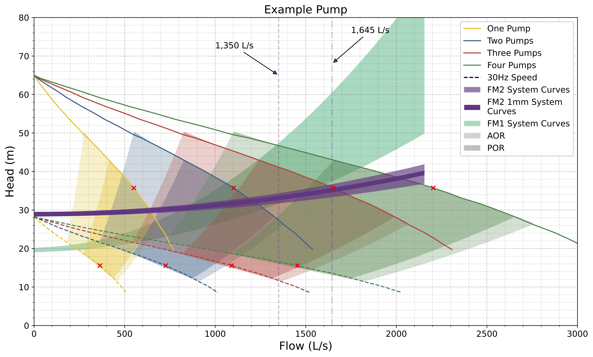

# Pump Curve Plotting

This script creates a nicely formatted pump curve pdf from an input excel file.
The script can be configured to plot multiple pumps in parallel, with various speeds and allowable and preferable operating range (AOR/POR) areas.

The script is split into three functions located in the src folder:

*  helper_funcs: small modules containing functions that are common to both other files.
* build_pump_dataframes: modules that receives the raw pump input excel file and builds the additional columns required to plot parallel pumps, and various pump speeds. It then saves two seperate dataframes, one containing pump curve info, and another containing system curve info, as .pkl files in the output folder. This module can also save the full dataframe as an excel file in the outputs folder.

* plotting - Main plotting module. This pulls in the .pkl files saved by the build_pump_dataframes module and uses the information to create the figure.

## Config.yml

The config files holds most of the user input variables required to build the figure. It is split into three sub configurations: pump_config, plot_config, and save_config.

### pump_config

* **excel_filename**: Filename of the raw excel file to be read in. This should include the .xlsx suffix, but does not need to specify folder, as this file should always be located in /inputs.
* **aor_range**: Specified AOR range to considered. This is typically 50% to 125% of the best efficiency point (BEP) but may change by specific vendor/manufacturer. AOR range should be inputted as a ratio, not percent. i.e (0.5, 1.25 not 50%, 125%)
* **por_range**: Same as AOR range but for POR. Typically 0.75 to 1.2.
* **data_speeds**: range of speeds (percent) to build the plot from. These are not the speeds that will actually be plotted (defined later), but are used to create the best fit curves. Should be roughly 5 differend equally spaced speeds from your min to max speed. e.g. 66, 70, 80, 90, 100
* **num_pumps**: number of parallel pumps to plot
* **aor_por_fit_degree**: Sometimes the AOR/POR fill can be a poor fit for the pump curve and result in gaps. Increasing the degree of best fit here may mitigate this.

### plot_config

* **figure_height**: Figure height in inches
* **figure_width**: Figure width in inches
* **flow_units**: Units for flow (used for plot x axis title)
* **head_units**: Units for head (used for plot y axis title)
* **plot_speeds**: what spees to plot (just min and max typically looks best to avoid a busy graph)
* **plot_title**: Title of plot
* **xmax**: maximum x axis value
* **ymax**: maximum y axis value

### save_config
* **save_dataframe_to_excel**: save full dataframe to excel (true/false). If true dataframe will be saved in outputs folder. Various number of parallel pumps will be saved to difference sheets.
* **excel_save_filename**: filename to save full dataframe as
* **save_figure**: whether to save plot to outputs folder (true/false)
* **figure_save_name**: plot save name

# Build_pump_dataframes.py

No input should be needed here, all relevent info should be pulled in from the condfig file.

# plotting.py
I've tried to abstract out as much of the plotting as possible but this file still needs user input.

## main():
First the pickle files are loaded:

    df_list = load_pickle(Path("outputs", "pump_df_list.pkl"))
    sys_curve_df = load_pickle(Path("outputs", "sys_curve_df.pkl"))

The the main figure object is instatiated with the details from the config file:

    figure = PumpFigure(config_file["plot_config"])

The base fig is created with details like the grid, title, and axis titles:

    figure.build_base_fig()

Next, use the .plot_system_curves() method to add system curves as needed. The user should specify the column names used for plotting (as per the excel file). If the user wants to fill between a min/max system curve, they should selected fill = True as an argument and supply a list of column headers referring to the min/max head columns.
The .plot_system_curves() method can be used multiple times to add multiple system curves.
It also accepts standard matplotlib kwargs such as linestyle, color, linewidth etc.

Next, the pump dataframes are plotted. This is done by iterating through the loaded pickle files (which contains a list of pump dataframes, correspoding to the number of parallel pumps) and adding speed curves, bep markers, and aor/por fills as required. The look should also enumerate through the list and set the iteration number to the figure.iteration attribute, failure to do so will result in figures with mismatching color aor/por and speed lines. These pump plotting methods also accept standard matplotlib kwargs such as linestyle, color, linewidth etc.

Next, legend entries must be manually created using:

    figure.create_legend_entry()

Again, the method accepts standard matplotlib kwargs.

Next add any require annotations or vertical horizontal lines with:

    figure.add_horizontal_line()
    figure.add_vertical_line()
    figure.annotate()

Finally if the config file specifies to save the figure it will be saved in the outputs folder.

# Running the script

The raw excel file should be loaded into the inputs folder. The build_pump_dataframe file should then be run, followed by the plotting file.

# Pump Curve Example Image

